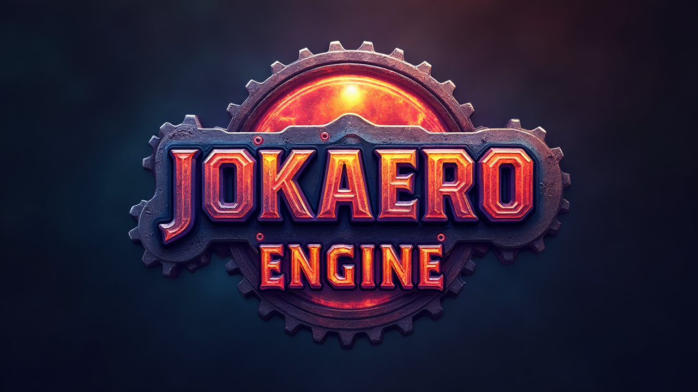

## Overview

Straightforward render engine.  
The demonstration of AZDO (Approach Zero Driver Overhead) and DSA (Direct State Access) principles.  
Practical implementation of various 3D techniques.  
Modern C++20 and latest OpenGL with extensions (Vulcan Subgroups, Bindless Textures).



## Table of Contents

- MultiThreaded OpenGL (Shared Lists, Task System)
- Custom OpenGL Wrapper
- Skinning and Animations
- Bindless Textures with Anisotropy Filtering and LOD Bias
- Collision Primitives and Intersection
- Shader ecosystem: edit-aware cache, hot-reload, generated GLSL header
- Multiple Engine States (loading, main, etc.)
- ImGui interface with Guizmos
- Inputs (Keyboard, Mouse)
- Event callbacks
- Load/Save settings from file
- Quaternion camera system: FPS and Free

https://github.com/user-attachments/assets/488dc326-5993-4fc5-895d-644cf840d9af

https://github.com/user-attachments/assets/c2f9d112-ce19-49a6-b442-cefeb2aad8fa

## Techniques

Frustum Culling (Objects, Shadows), Occlusion Culling (Objects) [Compute shader]


Cluster Light Culling (Bitonic Sorting for shadowcasters) [Compute Shader]


Cascaded PCF shadowmapping: Bounding sphere method


Switchable Forward and Deferred pipelines, PBR (metallic/roughness), IBL, for Opaque, Alpha Clip and Alpha Blend meshes


Order-independent transparency (OIT)

https://github.com/user-attachments/assets/653d24d3-794e-4aad-a041-0bb2cf95d8bb

Instanced Particles [Compute shader]

https://github.com/user-attachments/assets/9eecae45-74c7-497a-be12-4d0de9b8445f

Outline Selection: Pixel-point selection via depth buffer

https://github.com/user-attachments/assets/921c3b4b-cc02-47a4-8f39-0b92dfb9fc93

Postprocess:

- Correct Luminosity Encoding
- Tonemapping
- HDR Bloom [Compute shader]

  https://github.com/user-attachments/assets/fb51f386-363b-4c5d-8b47-432a439ad2ca

- FXAA
  

HBAO - Cache-Aware: [NVIDIA DesignWorks Samples](https://github.com/nvpro-samples/gl_ssao)


GTAO: [ported from DX12 to OpenGL](https://github.com/GameTechDev/XeGTAO)


Simple Crosshair [Geometry shader]

Debug shaders:

- Boxes, Cameras
- Point Lights
- Normals
- Texture Buffers (Layers)

https://github.com/user-attachments/assets/78926f31-13c6-4c18-a112-1dbb3c8293df

## Controls

**Tab** - Toggle UI  
**1** - Settings window  
**2** - Active window  
**3** - Resources window  
**4** - ImGUI Demo window  
**LMB** - Select object  
**RMB** - Object Context Menu  
**WASD/Space/Control** - Camera  
**R** - Reset camera  
**G** - Toggle guizmo  
**V/F** - Input events  
**Esc** - Close

## Assets (Blender)

Export FBX from Blender.
OpenGL Z axis is forward-backward.
Blender Z axis is top-bottom.

Static objects:

- Rotate all -90deg by X, Apply transformation, Rotate all +90deg by X
- Transform: select "Apply Scalings" -> FBX All
- Geometry: tick "Triangulate Faces" and "Tangent Space"


Skinned objects:

- The same as Static objects
- Set scale of Armature and Objects to 0.01 (Blender use meters vs FBX centimeters)
- Armature: tick "Only Deform Bones", untick "Add Leaf Bones"


Transparent Materials:

- Append/Insert/Prepend "AlphaClip" or "AlphaBlend" at the name of material
  (case doesn't matter)
- Set 'Alpha' value in the BSDF node manually (Value inverted!)


## TODO

- GLX (Linux, X11) support
- VRAM dynamic allocation
- LOD system
- Fix cascades clipping
- Texture Atlases
- Load model from UI
- Load scene from file
- Load keybinds from file

## Building (Windows)

Install vcpkg:

```Console
git clone https://github.com/microsoft/vcpkg.git
cd vcpkg && .\bootstrap-vcpkg.bat -disableMetrics
```

Configure the VCPKG_ROOT environment variable.  
Reccomended to use VSCode with CMake Tools extension.

Compiled engine path: ./engine  
Assets path: ./engine/resources  
**ASSETS** [Google Drive](https://drive.google.com/file/d/1XR-YKDKVX4LAbK6__Ltu92FB9UAVReJl/view?usp=sharing)

## Dependencies

Assets: [Assimp](https://github.com/assimp/assimp)  
Window management: [GLFW3](https://github.com/glfw/glfw)  
Math: [GLM](https://github.com/g-truc/glm)  
Interface: [ImGui](https://github.com/ocornut/imgui) and [ImGuizmo](https://github.com/CedricGuillemet/ImGuizmo)  
Memory allocation: [MiMalloc](https://github.com/microsoft/mimalloc)  
Input/Events: [Sigslot](https://github.com/palacaze/sigslot)  
Logger: [spdlog](https://github.com/gabime/spdlog)  
Settings: [simpleini](https://github.com/brofield/simpleini)  
Textures: [stb](https://github.com/nothings/stb)  
Text fromat: [FMT](https://github.com/fmtlib/fmt)  
Console: [indicators](https://github.com/p-ranav/indicators)  
DI: [Google Fruit DI library](https://github.com/google/fruit)  
Enum: [Magic Enum](https://github.com/Neargye/magic_enum)

## License

The code in this repository is licensed under the MIT License.
The libraries provided by ports are licensed under the terms of their original authors.
